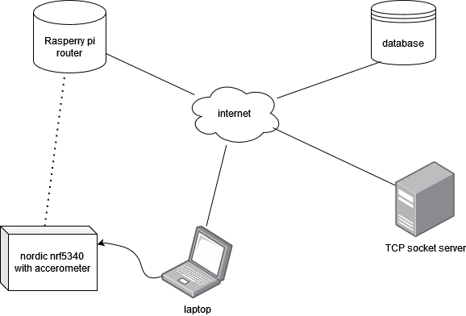
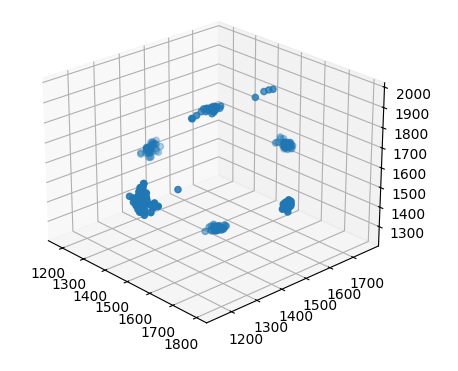
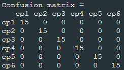
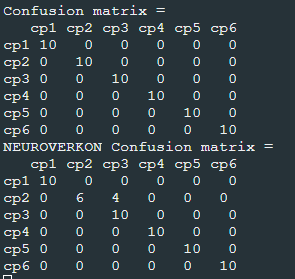

# Tietoliikenteen sovellusprojekti, ryhmä 14

This project will consist of a client gathering sensor data that relays said data to IoT-router (Raspberry Pi). This router will relay data to Oamk MySQL server.

The database will be accessible by TCP-socket API and a simple HTTP API. The stored data will be retrieved for processing for machine learning purposes on a PC.

## Nordic Semiconductior nrf5340
This platform is central in this application. It runs code for an Analog to Digital Converter (ADC), which is used to get data from an acceleration sensor. There also is a bluetooth service for relaying the gathered data onward, in this case to a raspberry pi.

## Rasperry Pi
This will be running python code that allows us to connect to the service running on the Nordic board, and relay the data received via notifications to a database

## TCP socket and HTTP API
The http API was provided to us, so this project only has python code to connect a tcp socket to the database server and send a request for data. Then the received data is stored in .csv format 

## Machine Learning Software
This project has a K-means algorithm that (provided good enough data and epochs) learns 6 orientations corresponding to 6 directions the sensor can face, and then can estimate the orientation of arbitrary sensor data based on this. As an extra assignment, we also taught these points to a neural network (this code in the jupiter .ipynb file) and implemented the taught neural network in C running on the Nordic board. 

Below is a visualization of the training data used for k-means algorithm 

Below is a picture of k-means confusion matrix made with real data measurements. Rows correspond to what "direction" the nrf board is supposed to measure, and columns correspond to closest center point

Below is a picture of two confusion matrices. Both matrices use the same data for calculations, the first one is k-means as described above, and the one below is filled with decisions of the trained neural network. 

